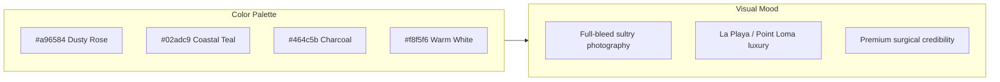
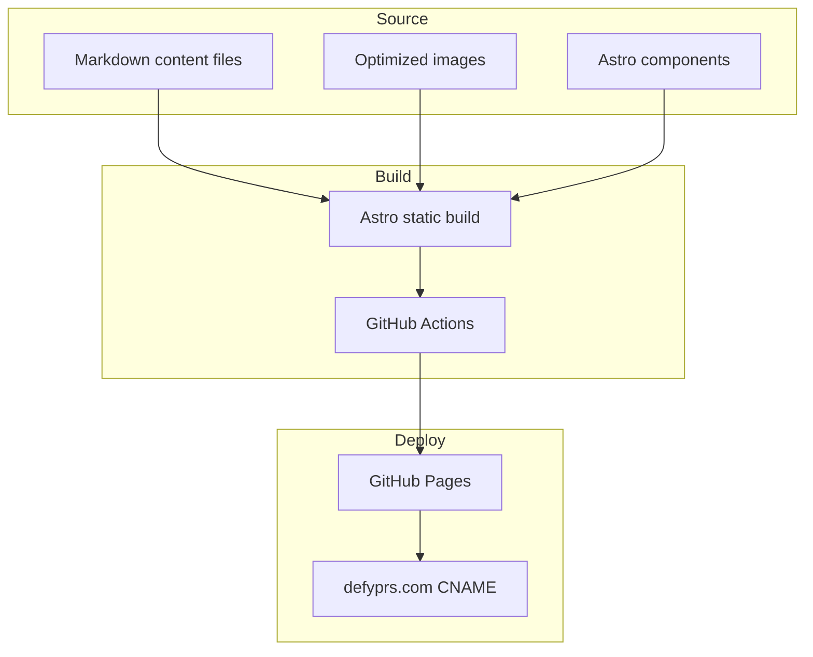

> Reimplement defyprs.com as a modern, GitHub Pages-deployable static site using Astro, preserving all currently visible content and the sultry San Diego aesthetic (dusty-rose + coastal teal, photography-forward layout) while replacing the legacy jQuery/Bootstrap template stack.

# DEFY PRS Modern Static Site Reimplementation

## Current Site Analysis

The live site at [defyprs.com](https://defyprs.com) (www redirects here) is a **Firebase-hosted** static HTML site built on a purchased **Medical Guide** template (~2017). It loads **15+ CSS files** and **jQuery + Revolution Slider + Owl Carousel + CubePortfolio + mmenu**, plus a full-screen **"Loading..." preloader** that hurts first paint.

### Visible pages to rebuild (8 pages)

| Page | URL | Active content |
|------|-----|----------------|
| Home | `/` | Hero image, intro copy, "Meet Our Specialist" card for Dr. Apostolides |
| About Us | `/about-us` | Welcome story + specialist repeat section |
| Meet John | `/meet-john` | Full bio, credentials, family info |
| Aging | `/aging` | Anti-aging copy + 3-image carousel |
| Cancer | `/cancer` | Breast reconstruction expertise + 3-image carousel |
| Gravity | `/gravity` | Body rejuvenation copy + 3-image carousel |
| Services | `/services` | Accordion: Reconstruction (6), Cosmetic (14), Injectables (7) |
| Contact | `/contact-us` | Google Maps embed + footer contact info |

**Excluded per your scope:** commented-out appointment form, contact form, `meet-defy.html` team grid (hidden from nav), `reviews.html` (404), and all lorem-ipsum template blocks.

### External links to preserve

- Phone: `tel:+16192223339`
- Email: `info@defyprs.com`
- Maps: [Google Maps listing](https://goo.gl/maps/un61iZX8xUG2)
- Patient Portal (eClinicalWorks), CareCredit, PatientFi
- Social (on team imagery overlays): Facebook, LinkedIn, Yelp

### Brand aesthetic to preserve



- **Primary accent:** `#a96584` (dusty mauve/rose — sultry, feminine, used on nav active states, headings, CTAs)
- **Secondary accent:** `#02adc9` (coastal teal — San Diego ocean vibe, used in overlays)
- **Photography-forward:** `defy-woman-bg.png` hero, banner images per section, carousel galleries on expertise pages
- **Tone:** confident, exclusive, warm — "DEFY the standard" positioning, Johns Hopkins credentials, La Playa/Point Loma neighborhood emphasis

---

## Recommended Stack (GitHub Pages)

**Astro 5 + Tailwind CSS 4** — outputs pure static HTML/CSS with zero runtime JS by default, deploys cleanly to GitHub Pages via GitHub Actions.

Why Astro over plain HTML:
- Reusable layout/components (header, footer, nav) without copy-paste
- Content as Markdown/JSON — easier to maintain medical copy
- Built-in image optimization (`astro:assets`)
- Clean URLs (`/about-us` instead of `/about-us.html`)
- ~0 KB client JS unless we add a lightweight carousel

**Project location:** `~/projects/defy/`

---

## Architecture



### Directory structure

```
~/projects/defy/
├── PLAN.md                      # this file
├── .github/workflows/deploy.yml
├── public/
│   ├── CNAME                    # defyprs.com
│   ├── favicon.png
│   └── images/                  # migrated + optimized assets
├── src/
│   ├── content/
│   │   ├── pages/               # per-page markdown (copy)
│   │   └── services.json        # accordion service lists
│   ├── components/
│   │   ├── Header.astro
│   │   ├── Footer.astro
│   │   ├── Hero.astro
│   │   ├── SpecialistCard.astro
│   │   ├── ImageCarousel.astro
│   │   ├── ServicesAccordion.astro
│   │   ├── SubBanner.astro
│   │   └── MapEmbed.astro
│   ├── layouts/
│   │   └── BaseLayout.astro
│   ├── styles/
│   │   └── global.css           # Tailwind + brand tokens
│   └── pages/
│       ├── index.astro
│       ├── about-us.astro
│       ├── meet-john.astro
│       ├── aging.astro
│       ├── cancer.astro
│       ├── gravity.astro
│       ├── services.astro
│       └── contact-us.astro
├── astro.config.mjs
└── package.json
```

---

## Design System (Modernized, Same Soul)

### Typography
- **Headings:** elegant serif (e.g. `Cormorant Garamond` or `Playfair Display`) — evokes luxury med-spa
- **Body:** clean sans (e.g. `Inter` or `Source Sans 3`) — readable medical content
- Replace template icon font with **Lucide** or **Heroicons** (SVG, accessible)

### Layout modernization
| Legacy | Modern replacement |
|--------|-------------------|
| Revolution Slider (1 slide) | CSS `background-image` hero with subtle Ken Burns animation |
| Owl Carousel | CSS scroll-snap carousel or ~3KB Swiper (touch-friendly) |
| Bootstrap 3 grid | Tailwind responsive grid |
| jQuery mmenu | CSS mobile drawer + `<details>` or 2KB Alpine.js |
| Preloader | Remove entirely |
| Sticky header JS | `position: sticky` + CSS |
| `.html` URLs | Clean URLs via Astro (`/about-us`) |

### Key UI patterns to recreate
1. **Top bar** — phone + email + map pin (slim, always visible)
2. **Header** — DEFY logo left, horizontal nav right, dusty-rose active state
3. **Hero** — full-viewport `defy-woman-bg` with dark gradient overlay + intro text below fold
4. **Sub-banners** — page-specific banner images with breadcrumb (Home > Section)
5. **Two-column expertise pages** — prose left, image carousel right
6. **Services accordion** — three expandable categories (Reconstruction / Cosmetic / Injectables)
7. **Footer** — two-column Guide + Get In Touch, external portal/financing links

### Responsive behavior
- Mobile: hamburger menu, stacked columns, carousel swipe, tap-friendly accordion
- Preserve generous whitespace and large photography — don't over-compress the sultry feel on mobile

---

## Content Migration Plan

### Phase 1: Asset harvest
Download all 27 images from the live site into `public/images/`:

- Branding: `defy-logo.png`, `favicon-defy.png`
- Heroes/banners: `defy-woman-bg.png`, `about-banner.jpg`, `meet-john-banner.jpg`, `expertise-banner.jpg`, `services-banner2.jpg`, `contact-banner3.jpg`
- People: `dr-a-629.jpg`, `dr-john-apostolides-716.jpg`
- About: `defy-woman-tmp.jpg`
- Carousels: `aging-caro{1-3}.jpg`, `cancer-caro{1-3}.jpg`, `gravity-caro{1-3}.jpg`

Run through Astro image pipeline → WebP/AVIF with responsive `srcset`.

### Phase 2: Copy extraction
Extract verbatim text from live HTML into markdown content files. Key content blocks:

- **Home intro:** Johns Hopkins training, "DEFY the standard" mission statement
- **About Us:** San Diego market story, La Playa/Point Loma location, patient-centered office design
- **Meet John:** Full bio (Georgetown, Maryland, Johns Hopkins, board certifications, family)
- **Aging / Cancer / Gravity:** Medical expertise paragraphs (substantive, not placeholder)
- **Services:** 27 named procedures across 3 categories (names only — no detail pages exist today)
- **Contact/Footer:** 1322 Scott Street Suite 102, San Diego CA 92106; Mon–Fri 9am–5pm; (619) 222-3339; fax (619) 223-3339

### Phase 3: SEO hardening (improvement over original)
The current site has **empty `<meta description>` and `<keywords>`** on every page. Add:
- Unique `<title>` and `<meta name="description">` per page
- Open Graph tags (hero image, practice name)
- LocalBusiness JSON-LD schema (address, phone, hours, surgeon name)
- `sitemap.xml` + `robots.txt`

---

## GitHub Pages Deployment

### `astro.config.mjs`
```js
export default defineConfig({
  site: 'https://defyprs.com',
  output: 'static',
});
```

### `.github/workflows/deploy.yml`
Standard Astro → GitHub Pages workflow using `withastro/action` or `peaceiris/actions-gh-pages`, deploying `dist/` to `gh-pages` branch.

### DNS cutover (when ready)
1. Add `public/CNAME` with `defyprs.com`
2. Point domain A/CNAME records to GitHub Pages
3. Enable HTTPS in repo Settings → Pages
4. Decommission Firebase Hosting after verification

### URL redirects
Add `_redirects` or Astro middleware-compatible static redirects for legacy `.html` URLs:
- `/about-us.html` → `/about-us`
- `/meet-john.html` → `/meet-john`
- (etc. for all 8 pages)

---

## Implementation Phases

### Phase A — Scaffold (day 1)
- Init Astro project + Tailwind + GitHub Actions deploy pipeline
- Build `BaseLayout`, `Header`, `Footer` with brand tokens
- Verify deploy to `*.github.io` URL

### Phase B — Core pages (days 2–3)
- Home, About Us, Meet John with hero + specialist card
- Sub-banner component + breadcrumb pattern

### Phase C — Expertise + Services (days 3–4)
- Aging, Cancer, Gravity pages with carousel
- Services accordion from `services.json`

### Phase D — Contact + polish (day 5)
- Contact page with Maps embed
- Image optimization pass
- SEO meta + JSON-LD
- Cross-browser + mobile QA
- Legacy URL redirects

### Phase E — Launch (day 6)
- Custom domain DNS cutover
- Lighthouse audit (target: 90+ performance, 100 accessibility)
- Remove Firebase hosting

---

## Quality Checklist

- [ ] All 8 visible pages render with identical copy to live site
- [ ] Brand colors match (`#a96584`, `#02adc9`)
- [ ] Hero and banner photography preserved
- [ ] All external links (portal, CareCredit, PatientFi, social) work
- [ ] Mobile nav + accordion + carousel functional without jQuery
- [ ] No preloader, no console errors
- [ ] Lighthouse Performance ≥ 90 (vs. likely ~30–50 today)
- [ ] Legacy `.html` URLs redirect correctly

---

## Risk Notes

1. **Image rights** — confirm you have rights to reuse all photography (especially `defy-woman-bg.png` and carousel images) before publishing a new repo.
2. **Contact hours typo** — live contact page (commented out) says "9pm–5pm"; footer says "9am–5pm". Use **9am–5pm** (footer is the visible source of truth).
3. **Firebase → GitHub Pages** — plan a DNS cutover window; keep Firebase live until the new site is verified.
4. **No forms** — per scope, contact is map + phone/email only. If appointment requests are needed later, add a `mailto:` CTA or a third-party form (Formspree, Netlify Forms won't work on GH Pages without external service).

## Todos

- [ ] **scaffold** — Create Astro + Tailwind project at ~/projects/defy with GitHub Actions deploy to Pages
- [ ] **design-system** — Implement brand tokens (#a96584, #02adc9), typography, Header/Footer/SubBanner components
- [ ] **migrate-assets** — Download and optimize all 27 images from live site into public/images/
- [ ] **extract-content** — Extract verbatim copy into markdown/JSON content files for all 8 visible pages
- [ ] **build-pages** — Implement all 8 pages: home, about, meet-john, aging, cancer, gravity, services, contact
- [ ] **seo-redirects** — Add per-page meta tags, JSON-LD, sitemap.xml, and .html URL redirects
- [ ] **qa-launch** — Mobile/desktop QA, Lighthouse audit, DNS cutover to defyprs.com via CNAME